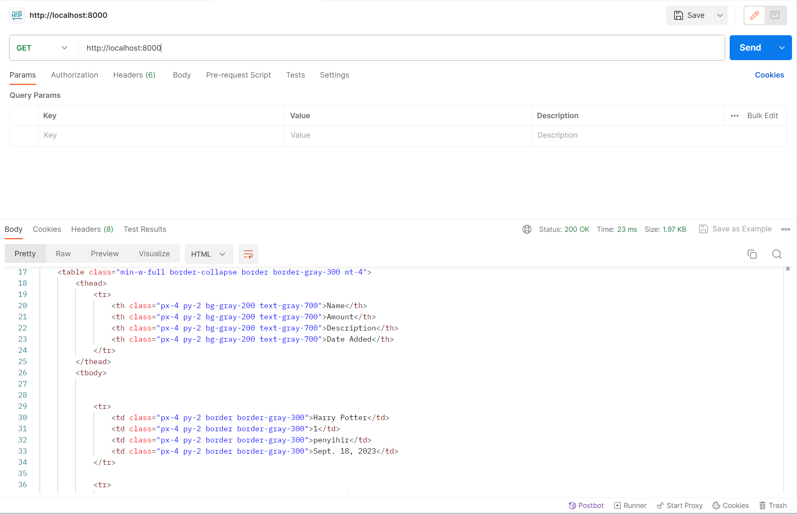
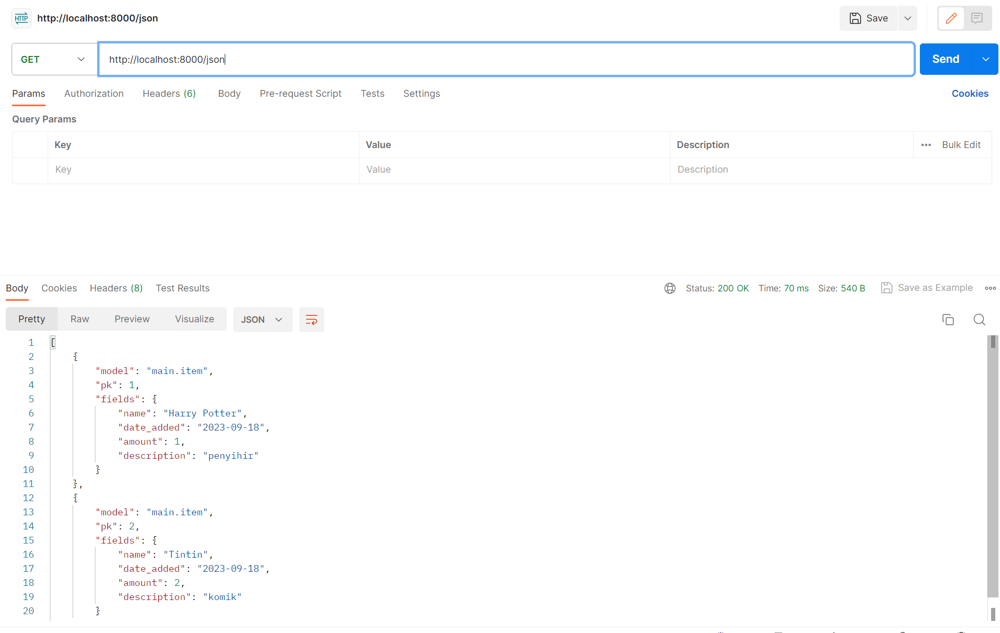
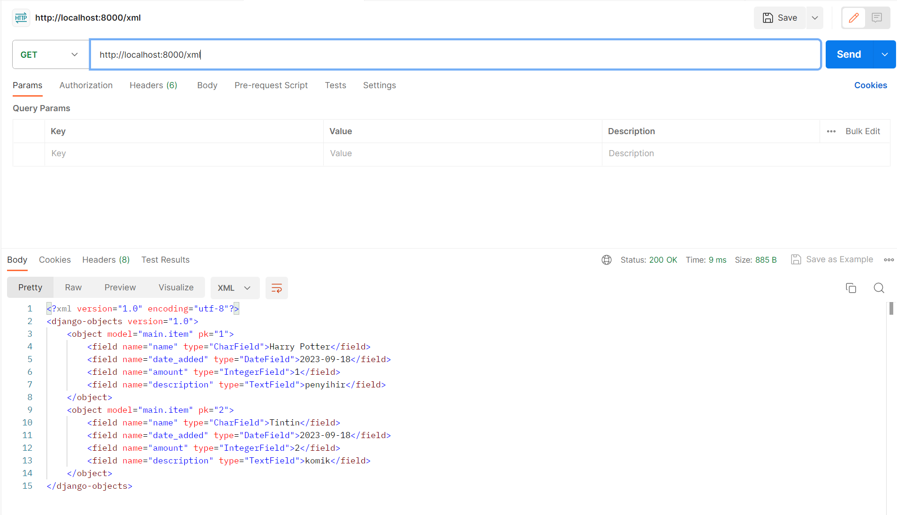
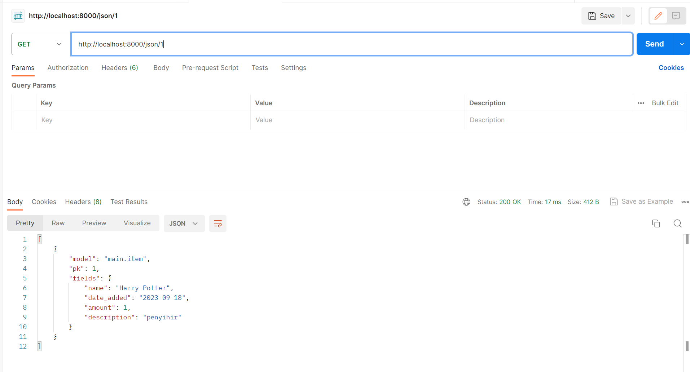
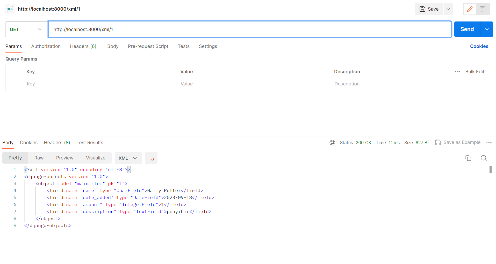

<details>
<summary>Tugas 2</summary>

# Cara Implementasi
## Setup Library yang dibutuhkan
Pertama-tama, membuat file `requirements.txt` yang berisi
```
django
gunicorn
whitenoise
psycopg2-binary
requests
urllib3
```

Kita ingin mendownload hal-hal dalam requirements.txt tersebut dalam virtual environment.
Installasi saya lakukan dalam windows powershell dengan cara:

```sh
python -m venv env # Buat virtual env
./venv/Scripts/activate # pada windows atau
pip install -r requirements.txt #
```

## 1. Membuat sebuah proyek Django baru

Saya membuat project baru dengan nama `INVENTORY` dengan cara `django-admin createproject INVENTORY`, akan membuat direktori baru dengan nama `INVENTORY`. Direktori akan berisi `manage.py` dan folder `INVENTORY` yang berisi terkait setting dan routing dari proyek. `manage.py` adalah script python yang akan kita gunakan untuk memantain dan mengatur proyek kita. `python manage.py runserver` adalah command untuk menjalankan proyek kita.

## 2. Membuat aplikasi dengan nama main

Kemudian saya membuat app baru bernama main dengan cara `python manage.py createapp main`. Applikasi dalam bentuk folder baru dengan nama `main`. Setelah membuat aplikasi, saya mendaftarkannya pada `settings.py` yang terletak di folder `INVENTORY`. Tambahkan `main` pada `INSTALLED_APPS` sehingaa berbentuk seperti
```python
INSTALLED_APPS = [
    'django.contrib.admin',
    'django.contrib.auth',
    'django.contrib.contenttypes',
    'django.contrib.sessions',
    'django.contrib.messages',
    'django.contrib.staticfiles',
    'main'
]
```
## 3. Melakukan routing proyek agar dapat menjalankan aplikasi
Konfigurasi link `main` pada proyek dengan cara menambahkan `path('main/', include('main.urls'))` pada `urls.py` yang terletak di direktori `INVENTORY`. `urls.py` pada `INVENTORY` nantinya akan terlihat seperti ini:
```python
from django.contrib import admin
from django.urls import path, include

urlpatterns = [
    path('admin/', admin.site.urls),
    path('main/', include('main.urls'))
]

```
Kemudian buat `urls.py` pada folder `main` dengan kode seperti ini:
```python
from django.urls import path
from . import views

urlpatterns = [
	path('',show_main,name = 'show_main'),
]
```
Dengan begini ketika kita menuju `http://localhost:8000/main` pada browser, kita akan dihadapkan dengan apa yang direturn fungsi `show_main` pada `views.py` 

## 4.Membuat fungsi render pada views.py dan membuat main.html dalam folder templates

buat direktori `templates` pada `main` dan buat file html yang akan dirender dengan nama `main.html`. 
`main.html` yang saya buat sebagai berikut

```python
<h1>{{name_app}}</h1>
<h5>Name: </h5>
<p>{{name}}</p>
<h5>Class: </h5>
<p>{{class}}</p>
```
pada `views.py` kita dapat membuat fungsi untuk mengembalikan `main.html` dengan cara

```python
from django.shortcuts import render

def show_main(request):
    context={
        'name_app' : 'inventory',
        'name' : 'Edbert',
        'class' : 'PBP D'
    }
    return render(request,"main.html",context)
```

variabel `name_app`, `name`, `class` pada main.html didapat dari context saat fungsi `show_main` memanggil main.html 

## 5. Membuat model sebagai Database
Model adalah penghubung python dengan database kita. membuat model dalam file `models.py` pada aplikasi `main` dengan nama `Item`
```python
from django.db import models

class Item(models.Model):
    name = models.CharField(max_length = 255)
    amount = models.IntegerField()
    description = models.TextField()
```

## 6. Melakukan deployment ke Adaptable

## Bagan Aplikasi berbasis django


## Mengapa virtual environment

Virtual environment digunakan dalam pengembangan software untuk mengisolasi dan mengelola dependensi proyek secara efisien. Hal ini membantu dalam mencegah konflik dependensi, memastikan kompatibilitas dengan versi Python yang benar. Saat mengembangkan aplikasi web berbasis Django atau proyek software lainnya, sangat disarankan untuk selalu menggunakan virtual environment agar dapat menjalankan proyek dengan lebih lancar dan menghindari masalah yang mungkin timbul akibat konflik dependensi dan versi.

kita masih dapat membuat aplikasi web berbasis Django tanpa menggunakan virtual environment, tetapi ini tidak disarankan dan dapat mengakibatkan sejumlah masalah. Tanpa virtual environment, proyek Django menggunakan lingkungan Python dan dependensi sistem secara global. Ini dapat menyebabkan konflik dependensi, karena proyek mungkin memerlukan versi paket yang berbeda dengan proyek lain.

# Apa itu MVC, MVT, MVVM
1. **MVC** (Model View Controller) adalah pattern desain framework yang memisahkan applikasi menjadi 3 komponen, yaitu model, view, dan controller. MVC adalah komponen yang sering digunakan industri untuk membuat applikasi yang scalable dan extensible.


2. **MVT** (Model View Template) adalah pattern desain yang mirip dengan MVC. Perbedaannya adalah controller diimplementasikan oleh framework sendiri sehingga kita hanya perlu membuat template. Memungkinkan untuk pengembangan yang lebih scalable, cepat, namun terdapat ketergantungan terhadap framework yang digunakan.


3. **MVVM** (Model View ViewModel) adalah pattern desain yang fokus pada membedakan user interface (UI) dengan logic dari applikasi kita. Controller pada MVVM berada pada ViewModel. Memungkinkan untuk pemisahan kerja yang lebih baik antara UI dan logic sesuai dengan kelebihan pengembang. ViewModel dapat terlihat sangat kompleks dan susah didebug jika sudah terdapat banyak logic dan binding. 


</details>

<details>
<summary>Tugas 3</summary>

# Perbedaan antara POST dan GET pada Django?

POST: Menggunakan metode HTTP POST. Data form dikirim dalam badan permintaan HTTP, yang biasanya tidak terlihat oleh pengguna.POST Lebih aman daripada GET karena data dikirimkan secara tersembunyi dalam badan permintaan HTTP. Ini cocok untuk mengirim data yang sensitif, seperti kata sandi atau informasi pribadi.

GET: Menggunakan metode HTTP GET. Data form disertakan dalam URL sebagai parameter query string, yang terlihat oleh pengguna. GET juga Kurang aman karena data form terlihat dalam URL, sehingga dapat dengan mudah diakses oleh siapa saja yang melihat URL. 

# Apa perbedaan utama antara XML, JSON, dan HTML dalam konteks pengiriman data?

1.XML (eXtensible Markup Language): XML adalah bahasa markup yang digunakan untuk menggambarkan data dalam bentuk dokumen berhierarki. Sistem XML mirip seperti tree yang memiliki 1 root.

2.JSON (JavaScript Object Notation): data nya disimpan dalam bentuk key-value seperti dictionary dalam python. JSON seringkali digunakan dalam pengiriman data antar web API.

3.HTML (Hypertext Markup Language): HTML adalah bahasa markup khusus yang digunakan untuk membuat halaman web dengan tujuan utamanya adalah mengatur tampilan dan konten halaman web dan tidak efisien untuk menstrafer data secara murni.

# Mengapa JSON sering digunakan dalam pertukaran data antara aplikasi web modern?

JSON sering digunakan dalam pertukaran data antara aplikasi web modern karena kesederhanaan, keringanan, dan kompatibilitasnya. JSON yang berbentuk key-value sperti dictionary tersebut juga cukup human readable. 

# Cara Implementasi

## Membuat Form (`forms.py`)

`APP/forms.py` akan mengimplementasikan library `django.forms` yang akan mempermudah pembuatan form kita karena seluruh html sudah dihandle oleh library form tersebut. Contoh isi `APP/forms.py` adalah.
```python
from django.forms import ModelForm
from main.models import Item

class ItemForm(ModelForm):
    class Meta:
        model = Item
        fields = ["name","amount","description"]
```
dimana `name`, `amount`, dan `description` adalah field yang ada pada model `Item` yang sudah didefinisikan.

## Merender form yang dibuat

Untuk merender form yang sudah kita buat, kita dapat menggunakan kemudahan library django. Pada `create_item.html`, kita tinggal menulis code sebagai berikut

```html
<form method="POST">
    
    <table>
        {{ form.as_table }}
        <tr>
            <td></td>
            <td>
                <input type="submit" value="Add Product"/>
            </td>
        </tr>
    </table>
</form>
```
`csrf_token` token wajib didefinisikan setiap definisi form, hal ini terkait dengan keamanan. `form.as_table` akan merender form secara keseluruhan kecuali button submit yang perlu kita tulis sendiri.

## Menambahkan masing-masing function pada views.py untuk serializer json dan xml

```python
def show_xml(request):
    data = Item.objects.all()
    return HttpResponse(serializers.serialize("xml",data),content_type="application/xml")

def show_json(request):
    data = Item.objects.all()
    return HttpResponse(serializers.serialize("json",data),content_type = "application/json")

def show_xml_by_id(request,id):
    data = Item.objects.filter(pk = id)
    return HttpResponse(serializers.serialize("xml",data),content_type = "application/xml")

def show_json_by_id(request,id):
    data = Item.objects.filter(pk = id)
    return HttpResponse(serializers.serialize("json",data),content_type = "application/json")
```

## Menambahkan routing pada dalam urls.py

```python
from django.urls import path
from main.views import show_main,create_item,show_xml,show_json,show_xml_by_id,show_json_by_id
app_name = 'main'

urlpatterns=[
    path('',show_main,name = 'show_main'),
    path('create-item',create_item,name = 'create_item'),
    path('xml/',show_xml,name = 'show_xml'),
    path('json/',show_json,name='show_json'),
    path('xml/<int:id>/',show_xml_by_id,name="show_xml_by_id"),
    path('json/<int:id>/',show_json_by_id,name = "show_json_by_id"),
]
```
`<int:id>` merupakan contoh dynamic routing yang mana nilai `id` berupa sebuah angka

## SS hasil Postman

1.HTML


2.JSON


3.XML


4.JSON (by id)


5.XML (by id)


</details>

<details>

<summary>Tugas 4</summary>

# Cara Implementasi

## 1.Membuat html register page

Membuat register html dengan pesan jika registrasi user berhasil.

contoh code nya :

```python



    <title>Register</title>


  

<div class = "login">
    
    <h1>Register</h1>  

        <form method="POST" >  
              
            <table>  
                {{ form.as_table }}  
                <tr>  
                    <td></td>
                    <td><input type="submit" name="submit" value="Daftar"/></td>  
                </tr>  
            </table>  
        </form>

      
        <ul>   
              
                <li>{{ message }}</li>  
                  
        </ul>   
    

</div>  


```
form adalah form django yang di passing dari fungsi `register` yang kita buat dalam views.py seperti ini:

```python
def register(request):
    form = UserCreationForm()
    if request.method == 'POST':
        form = UserCreationForm(request.POST)
        if form.is_valid():
            form.save()
            messages.success(request,'Your account has been successfully created!')
            return redirect('main:login')
    context = {'form':form}
    return render(request,'register.html',context)
    
```
`UserCreationForm` untuk membuat form pembuatan user. Jika form tersebut valid maka data dalam form tersebut akan di save dan terdapat pesan sukses

## 2. Membuat Page Login
Membuat page login.html dengan contoh code seperti ini:

```python



    <title>Login</title>




<div class = "login">

    <h1>Login</h1>

    <form method="POST" action="">
        
        <table>
            <tr>
                <td>Username: </td>
                <td><input type="text" name="username" placeholder="Username" class="form-control"></td>
            </tr>
                    
            <tr>
                <td>Password: </td>
                <td><input type="password" name="password" placeholder="Password" class="form-control"></td>
            </tr>

            <tr>
                <td></td>
                <td><input class="btn login_btn" type="submit" value="Login"></td>
            </tr>
        </table>
    </form>

    
        <ul>
            
                <li>{{ message }}</li>
            
        </ul>
         
        
    Don't have an account yet? <a href="">Register Now</a>

</div>


```
Pada page tersebut, kita diminta untuk mengisi username dan passwordnya.

Kemudian saya buat function login_user dalam views.py seperti ini:

```python
def login_user(request):
    if request.method == 'POST':
        username = request.POST.get('username')
        password = request.POST.get('password')
        user = authenticate(request,username = username,password = password)
        if(user is not None):
            login(request,user)
            response = HttpResponseRedirect(reverse("main:show_main"))
            response.set_cookie('last_login',str(datetime.datetime.now()))
            return response
        else:
            messages.info(request,'Sorry,incorrect username or password. Please try again.')
    context = {}
    return render(request,'login.html',context)

```
Pada function tersebut, username dan password yang diinput dicek dengan menggunakan django `authenticate` untuk memverifikasi user yang sudah disave sebelumnya. kemudian terdapat login yaitu method bawaan django untuk memberi tau user yang sedang login. Kemudian disitu juga terdapat ` response.set_cookie('last_login',str(datetime.datetime.now()))` untuk memberi tau bahwa user tersebut login pada saat tersebut. 

Untuk membatasi agar sebuah page harus ada login user untuk dapat diakses, maka kita bisa menambahkan `@login_required(login_url = '/login')` diatas function page tersebut dalam views.py

## 3. Implementasi Logout User

Mengimplementasikan fungsi logout user dalam views.py seperti ini:
```python
def logout_user(request):
    logout(request)
    response = HttpResponseRedirect(reverse('main:login'))
    response.delete_cookie('last_login')
    return response
```

disitu juga ada `response.delete_cookie('last_login')` agar informasi last login user tersebut dihapus

## 4. Membuat 2 akun pengguna dan membuat 3 dummy data pada masing-masing akun pengguna

register 2 akun yang berbeda, untuk setiap akun, login kemudian tambahkan 3 dummy data

## 5. Menghubungkan model item dengan user

Menghubungkan user dengan model pada django menggunakan interface `user` dan menambahkannya sebagai ForeignKey.

```python
from django.db import models
from django.contrib.auth.models import User

class Item(models.Model):
    name = models.CharField(max_length = 255)
    date_added= models.DateField(auto_now_add=True)
    amount = models.IntegerField()
    description = models.TextField()
    user = models.ForeignKey(User,on_delete = models.CASCADE)
```

Pada saat kita ingin membuat object item pada suatu akun, maka kita perlu untuk mengassign user tersebut, sehingga fungsi `create_item` pada views.py akan seperti ini:

```python
def create_item(request):
    form = ItemForm(request.POST or None)
    if form.is_valid() and request.method == "POST":
        item = form.save(commit = False)
        item.user = request.user
        item.save()
        return HttpResponseRedirect(reverse('main:show_main'))
    
    context = {'form':form}
    return render(request,"create_item.html",context)
```
disitu terdapat `item.user = request.user` untuk mengassign terlebih dahulu user tersebut sebelum menyimpan data.

## 6. Menampilkan detail informasi pengguna, username yang sedang log in dan menerapkan cookies seperti last login pada halaman utama aplikasi

fungsi show_main yang menampilkan halaman utama aplikasi seperti ini:

```python
@login_required(login_url = '/login')
def show_main(request):
    items = Item.objects.filter(user = request.user)
    cnt = len(items)
    context={
        'name_app' : 'inventory',
        'name' : request.user.username,
        'class' : 'PBP D',
        'items' : items,
        'cnt': cnt,
        'last_login':request.COOKIES['last_login'],
    }
    return render(request,"main.html",context)
```

dalam context tersebut, `name` yang didapat dari `request.user.username` dan `last_login` didapat dari `request.COOKIES['last_login']`

## 7. Mengimplementasikan increase amount, decrease amount, dan delete item

membuat delte button pada main.html
`<a href="" class="text-red-500 hover:text-red-700">Delete</a>`

ketika delete dipencet maka akan di kirim ke url `/delete_item` beserta item_id nya.

url `main:delete_item` seperti ini `path('delete_item/<int:item_id>/', delete_item,name = "delete_item"),` , ia memanggil function delete_item pada views.py

```python
def delete_item(request,item_id):
    item = Item.objects.get(pk = item_id)
    item.delete()
    return HttpResponseRedirect(reverse('main:show_main'))

```
item dengan id tersebut didelete kemudian path dikembalikan ke homepage

membuat increase button pada main.html
`<a href="" class="text-red-500 hover:text-red-700">Increase</a>`

ketika increase dipencet maka akan di kirim ke url `/increase_item` beserta item_id nya.

url `main:increase_item` seperti ini `path('increase_item/<int:item_id>/',increase_item,name = "increase_item"),` , ia memanggil function increase_item pada views.py

```python
def increase_item(request,item_id):
    item = Item.objects.get(pk = item_id)
    item.amount += 1 
    item.save()
    return HttpResponseRedirect(reverse('main:show_main'))

```
item dengan id tersebut amount nya ditambah dengan 1 kemudian path dikembalikan ke homepage 

membuat decrease button pada main.html
`path('decrease_item/<int:item_id>/', decrease_item,name = "decrease_item"),`

ketika decrease dipencet maka akan di kirim ke url `/decrease_item` beserta item_id nya.

url `main:decrease_item` seperti ini `path('decrease_item/<int:item_id>/', decrease_item,name = "decrease_item"),` , ia memanggil function decrease_item pada views.py

```python
def decrease_item(request,item_id):
    item = Item.objects.get(pk = item_id)
    if(item.amount > 0):
        item.amount -= 1
    item.save()
    return HttpResponseRedirect(reverse('main:show_main'))


```
item dengan id tersebut amount nya dikurang dengan 1 jika amountnya > 0, kemudian path dikembalikan ke homepage 

## 8. Django UserCreationForm

Form bawaan dari django untuk memudahkan pembuatan user.
Kelebihannya adalah cepat dan mudah dipakai
Kekurangannya adalah form bawaan tersebut susah di kustomisasi

## 9. Perbedaan antara autentikasi dan otorisasi dalam Django dan mengapa keduanya penting

Autentikasi adalah proses verifikasi login user, sedangkan otorisasi adalah proses verifikasi akses user.

Keduanya mengatur hal yang berbeda dan penting dalam menjaga web security

## 10. Cookies dalam konteks aplikasi web, dan bagaimana Django menggunakan cookies untuk mengelola data sesi pengguna

Cookies adalah tempat penyimpanan bersifat sementara yang diberikan dari server web kepada browser. Browser kemudian menyimpan cookie dan kemudian selalu menyisipkan cookie pada request browser selanjutnya pada website tersebut. Pada browser, cookie tersebut memiliki variable nama dan value (data yang disimpan), domain website dan sebagainya.

## Apakah penggunakan cookies aman secara default dalam pengembangan web, atau apakah ada risiko potensial yang harus diwaspadai 

Cookies disimpan pada client sehingga keamanan bergantung sepenuhnya pada aktivitas client. Cookie secara transparan dapat dilihat oleh client sehingga data sensitif seharusnya tidak ditunjukkan. Karena sifatnya yang transparan, cookie dapat dicopy dan ditiru.


</details>

<details>

<summary> Tugas 5 </summary>

# Cara Implementasi

Pertama-tama, menambahkan tailwind `play CDN script` ke tag  `<head>` pada file base.html

```python
    <script src="https://cdn.tailwindcss.com"></script>
```

## 1.Kustomisasi page main

Pada halaman daftar inventori, saya membuat container yang memiliki background abu-abu muda yang berisi tabel daftar inventori. Saya menambahkan margin dan padding untuk tata letaknya. 
```python
<div class="container mx-auto mt-8 p-8 bg-gray-100 rounded-lg shadow-lg">


```
Didalam container tersebut, saya menggunakan tabel dengan beberapa kustomisasi seperti memberikan `border-b` pada setiap row. 

Pada setiap row, terdapat button delete, increase amount, dan decrease amount yang telah diberi warna dan warnanya menjadi lebih gelap saat dihover. 
```python
<a href="" class="text-red-500 hover:text-red-700">Delete</a>

<a href="" class="text-green-500 hover:text-green-700">Increase</a>

<a href="" class="text-orange-500 hover:text-orange-700">Decrease</a>
```
Di bagian paling bawah, terdapat informasi sesi terakhir login dan button Add new item juga logout. Saya style dengan `justify-between` agar komponen menyebar di tepi kiri dan kanan. Button Add new item dan logout juga diberi warna dan space antar button.

```python
<div class="flex justify-between items-center">
    <h5 class="text-lg font-semibold">Sesi terakhir login: {{ last_login }}</h5>
    
    <div class="flex space-x-4">
        <a href="" class="bg-blue-500 hover:bg-blue-700 text-white py-2 px-4 rounded focus:outline-none focus:shadow-outline">Add New Item</a>
        <a href="" class="bg-red-500 hover:bg-red-700 text-white py-2 px-4 rounded focus:outline-none focus:shadow-outline">Logout</a>
    </div>
</div>
```

## 2.Kustomisasi page login

Pada halaman login, saya style container dengan `flex justify-center items-center` agar container berada pada tengah screen.

```python
<div class = "flex justify-center items-center h-screen bg-gray-100">
```

Pada button login, saya menambahkan background biru, padding, dan berbentuk `rounded-full`. 
```python
<button class="bg-blue-500 rounded-full px-4 py-2 text-xl text-white mt-2">Login</button>
```
Jika terdapat message seperti login tidak berhasil, saya menambahkan warna merah pada teks tersebut.

```python

    <ul class = "text-base mt-4 text-red-500">
        
            <li>{{ message }}</li>
        
    </ul>
     
```
## 3.Kustomisasi page register

Pada halaman register, saya style mirip dengan login dengan `flex justify-center items-center` agar container berada pada tengah screen.

```python
<div class = "flex justify-center items-center h-screen bg-gray-100">
```

memisah-misah komponen pertanyaan pada form agar memiliki margin bottom seperti ini,

```python
<div class="mb-4">
    {{ form.username.label_tag }}
    {{ form.username }}
</div>
```

Pada button register, saya pun mengkustomisasi dengan menambah background biru, menjadi biru gelap ketika dihover, dan berbentuk `rounded-full`.

```python
<button type="submit" class="py-2 px-4 bg-blue-500 hover:bg-blue-700 text-white rounded-full focus:outline-none focus:shadow-outline">Register</button>
```

## 4. Kustomisasi Page Create New Item

Pertama-tama, input field pada item form dipisah-pisah terlebih dahulu dalam bentuk widgets agar dapat dikustomisasi dan dapat ditampilkan secara terpisah.

```python
widgets = {
    "name": TextInput(attrs={
        'class': 'min-w-[370px] border-2 focus:bg-gray-100 px-[12px] py-[6px]',
        'placeholder': 'Enter Name',
    }),
    "amount": NumberInput(attrs={
        'class': 'min-w-[370px] border-2 focus:bg-gray-100 px-[12px] py-[6px]',
        'min': 1,
        'placeholder': 'Enter Amount',
    }),
    "description": Textarea(attrs={
        'class': 'min-w-[370px] max-h-[150px] border-2 focus:bg-gray-100 px-[12px] py-[6px]',
        'placeholder': 'Enter Description',
    })
}
```
Pada halaman Add new item, saya style mirip dengan login dengan `flex justify-center items-center` agar container berada pada tengah screen.

```python
<div class = "flex justify-center items-center h-screen bg-gray-100">
```

memisah-misah komponen pertanyaan pada form agar memiliki margin bottom seperti ini,

```python
 <tr>
    <td>
        <h1 class="font-medium">Name</h1>
    </td>
</tr>

<tr class="mb-5">
    <td>
        {{form.name}}
    </td>
</tr>
```

input type submit pun saya kostumisasi dengan code seperti ini:

```python
<tr class="flex justify-center">
    <td class="flex justify-center w-1/2 bg-blue-500 text-white py-1 items-center rounded-lg">
        <input type="submit" value="Add Item"/>
    </td>
</tr>
```

# Pertanyaan

## Jelaskan manfaat dari setiap element selector dan kapan waktu yang tepat untuk menggunakannya.

Di CSS, "selector" dapat digunakan untuk memilih dan mengganti gaya elemen HTML. Selector dapat digunakan untuk memberikan styling pada suatu tag html.

1. Element Selector:
Selector ini digunakan untuk memilih semua elemen HTML dengan nama elemen tertentu.
```python
p {
  color: red;
}
```
Dalam contoh di atas, semua elemen `<p>` (paragraf) dalam halaman HTML akan memiliki warna teks merah.

2. ID Selector:
Selector ini digunakan untuk memilih elemen dengan atribut "id" tertentu.
```python
#header {
  background-color: red;
}
```
elemen dengan atribut id = "header" akan memiliki background berwarna merah.

3. Class Selector:
Selector ini digunakan untuk memilih elemen dengan atribut "class" tertentu.
```python
.btn-primary {
  background-color: red;
}
```
elemen dengan atribut class="btn-primary" akan memiliki background berwarna merah.

## Jelaskan HTML5 Tag yang kamu ketahui.
HTML5 adalah versi terbaru dari HTML.

terdapat tag-tag dasar yang mungkin sudah cukup umum seperti `<head>, <body>, <p>, <a>`.

terdapat juga beberapa tag lain seperti :

1.`<nav>` untuk mendifinisikan bagian navigasi dari halaman web.

2.`<header>` mengandung elemen-elemen yang berada di bagian atas halaman web atau bagian atas bagian lain dari halaman web. Biasanya, ini termasuk judul, logo, dan menu navigasi.

3.`<footer>` Elemen ini berada di bagian bawah halaman web.

4.`<article>` digunakan untuk menandai konten independen dalam halaman web. Ini bisa berupa artikel berita, posting blog, ulasan, atau konten mandiri lainnya.

5.`<section>` digunakan untuk mengelompokkan konten terkait dalam halaman web. 

## Jelaskan perbedaan antara margin dan padding.
Margin dan padding adalah 2 properti dalam css yang mengatur tata letak antar elemen. Margin mengatur tata letak antar elemen tersebut dengan sekitarnya, sedangkan padding mengatur tata letak elemen dalam tag tersebut. Contoh yang bagus adalah button yang memiliki content text didalamnya.


## Jelaskan perbedaan antara framework CSS Tailwind dan Bootstrap. Kapan sebaiknya kita menggunakan Bootstrap daripada Tailwind, dan sebaliknya?

Bootstrap menggunakan gaya dan komponen yang telah didefinisikan, sedangkan Tailwind css membangun tampilan dengan menggabungkan kelas-kelas utilitas yang telah didefinisikan sebelumnya.

Tailwind css memberikan fleksibilitas dan adaptabilitas yang tinggi, sedangkan Bootstrap sering kali menghasilkan tampilan yang lebih konsisten karena menggunakan komponen yang telah didefinisikan. 

Tailwind lebih baik digunakan saat memberikan styling yang lebih kompleks dan unik dalam jangka waktu yang lebih lama, sedangkan Bootstrap digunakan saat memberikan styling yang lebih sederhana dalam jangka waktu yang lebih cepat. 

</details>

<details>

<summary> Tugas 6 </summary>

# Pertanyaan

## Jelaskan perbedaan antara asynchronous programming dengan synchronous programming.

Dalam synchronous proggraming, tugas-tugas akan dieksekusi secara berurutan satu per satu. Ketika sebuah tugas dimulai, program akan menunggu hingga tugas tersebut selesai, sebelum melanjutkan ke tugas berikutnya.
Sedangkan dalam asynchronous proggraming, operasi dijalankan secara bersamaan.

## Jelaskan maksud dari paradigma event-driven programming tersebut dan sebutkan salah satu contoh penerapannya 

Event-driven programming merupakan saat program merespon suatu kejadian ketika terdapat suatu trigger yang terjadi. Salah satu contohnya adalah button counter dimana button tersebut akan menambahkan suatu nilai dengan satu hanya jika button dipencet (event).

## Jelaskan penerapan asynchronous programming pada AJAX.

Konsep utama di balik AJAX (Asynchronous JavaScript and XML) adalah kemampuan untuk mengirim permintaan ke server dan menerima respons dari server tanpa harus memuat ulang seluruh halaman web. Ini memungkinkan perubahan konten pada halaman web tanpa mengganggu atau merefresh seluruh halaman. 

## bandingkan Fetch API daripada library jQuery dan tuliskan pendapat  teknologi manakah yang lebih baik untuk digunakan.

Fetch API adalah bagian dari JavaScript modern dan merupakan bagian bawaan dari bahasa JavaScript. Ini berarti tidak perlu mengunduh atau mengimpor library tambahan, sehingga mengurangi overhead dan membuat halaman web lebih ringan. Fetch API mengadopsi konsep promise, yang memungkinkan untuk mengelola permintaan HTTP dengan cara yang lebih bersih dan mudah dipahami. Hal ini juga memberikan fleksibilitas dalam mengelola respons HTTP dalam berbagai format, seperti JSON, blob, dan lainnya. 

Di sisi lain, jQuery adalah library JavaScript yang telah ada sejak lama dan diketahui untuk kompatibilitasnya dengan berbagai browser yang lebih tua. Ini membuat jQuery bisa berguna jika  harus mendukung browser-browser lama. jQuery menyediakan abstraksi yang kuat untuk AJAX, sehingga memungkinkan penulisan kode yang lebih pendek dan lebih mudah digunakan untuk tugas-tugas sederhana.

Pilihan antara Fetch API dan jQuery tergantung pada kebutuhan proyek dan preferensi. Jika Anda ingin menggunakan teknologi yang lebih modern dan memiliki kemampuan yang lebih kuat, Fetch API adalah pilihan yang lebih baik. Namun, jika harus mendukung browser lama atau memerlukan kemudahan dalam penulisan kode untuk tugas sederhana, maka jQuery mungkin lebih sesuai.

# Implementasi

## 1.Mengubah kustomisasi halaman daftar inventori menggunakan card

Kurang lebih bentuknya akan seperti ini:

```python
<div id="item_card" class="w-full mb-8 flex flex-wrap justify-center">
        <!-- <div class="card max-w-sm w-full p-4 m-2 border bg-white shadow-lg rounded-lg overflow-hidden">
            <div class="px-4 py-2">
                <h2 class="text-xl font-semibold text-gray-700">Item Name</h2>
                <p class="mt-2 text-gray-600"><strong>Amount:</strong> 10</p>
                <p class="mt-2 text-gray-600"><strong>Description:</strong> Sample description of the item.</p>
                <p class="mt-2 text-gray-600"><strong>Date Added:</strong> 2023-10-11</p>
                <button data-id="${item.pk}" onclick="deleteItem(this.getAttribute('data-id'))" class="text-red-500 hover:text-red-700">Delete</button>

            </div> 
        </div> -->
    </div>
```

## 2.Menambah Ajax GET

Menambahkan kode berikut didalam script pada main.html

```python
    async function getItem() {
        return fetch("").then((res) => res.json())
    }
    async function refreshProducts() {
        document.getElementById("item_card").innerHTML = ""; // Clear the container
        const items = await getItem();
        
        items.forEach((item) => {
            let cardHTML = `
            <div class="card w-1/4 p-4 m-2 border rounded">
                <h2 class="text-xl">${item.fields.name}</h2>
                <p><strong>Amount:</strong> ${item.fields.amount}</p>
                <p><strong>Description:</strong> ${item.fields.description}</p>
                <p><strong>Date Added:</strong> ${item.fields.date_added}</p>
                <button data-id="${item.pk}" onclick="deleteItem(this.getAttribute('data-id'))" class="text-red-500 hover:text-red-700">Delete</button>
            </div>`;
            
            document.getElementById("item_card").innerHTML += cardHTML;
        });
    }

    refreshProducts();
```

fungsi getItem() akan dijalankan dalam refreshProducts() saat pertama kali halaman dimuat dan akan dipanggil setiap kali refreshProducts() dijalankan

## 3.Menambah Ajax POST

Membuat tombol yang membuka sebuah modal dengan form untuk menambahkan item. Tombol tersebut ketika dipencet, akan menampilkan suatu modal(yang sebelumnya hidden) yang berfungsi untuk mengisi data. Kemudian setelah mengisi semua data yang diperlukan, kita hanya perlu memencet button Add Product yang ketika diklik, akan memanggil fungsi addProduct yang melakukan fetch pada semua data pada form.

menambah addItem() pada script di html, then(refreshProducts) pada code tersebut akan merefresh daftar item terbaru setelah menambah item

```python
function addItem(){
        fetch("",{
            method : "POST",
            body : new FormData(document.querySelector('#form'))
        }).then(refreshProducts)

        document.getElementById("form").reset();
        return false;
    }

    document.getElementById("button_add").onclick = addItem;
```

membuat path yang mengarah ke fungsi add_item_ajax pada views
```python
    path('create-item-ajax/',add_item_ajax,name = 'add_item_ajax'),
```

menambah function add_item_ajax pada view.py

```python
@csrf_exempt
def add_item_ajax(request):
    if request.method == 'POST':
        name = request.POST.get('name')
        amount = request.POST.get('amount')
        description = request.POST.get('description')
        user = request.user
    
    new_item = Item(name = name,amount = amount,description = description, user = user)
    new_item.save()

    return HttpResponse(b"CREATED",status = 201)
```
## 4.Menambah AJAX Delete

menambah deleteItem() pada script di html, then(refreshProducts) pada code tersebut akan merefresh daftar item terbaru setelah menambah item

```python
async function deleteItem(itemId) {
        const deleteUrl = ``.replace('999', itemId);
        try {
            const response = await fetch(deleteUrl, {
                method: 'DELETE',
                headers: {
                    'X-CSRFToken': '{{ csrf_token }}'
                }
            }).then(refreshProducts)
            
        } catch (error) {
            console.error('Error:', error);
        }
    }
```

membuat path yang mengarah ke fungsi delete_item_ajax pada views
```python
    path('delete-item-ajax/<int:item_id>/', delete_item_ajax, name='delete_item_ajax'),
```

menambah function delete_item_ajax pada view.py

```python
@csrf_exempt
def delete_item_ajax(request, item_id):
    if request.method == 'DELETE':
        item = Item.objects.get(id=item_id)
        item.delete()
        return HttpResponse({'status': 'DELETED'}, status=200)
    
```
</details>